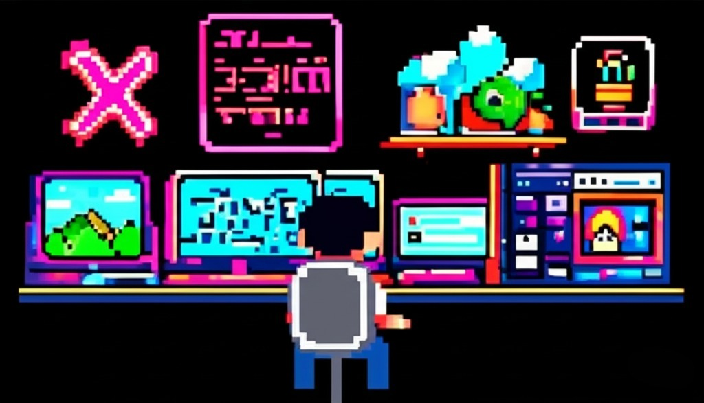

<h1 align="left">
  
</h1>

<!--
# Hi, I'm Louis Nguyen

-->

    

## 💫 About Me
- Currently studying Engineering Systems & Computing at the University of Guelph  
- Passionate about combining software and hardware to build meaningful systems and solve real world problems
- Enjoy physical and competitive activities

---

## 📬 Let's Connect

